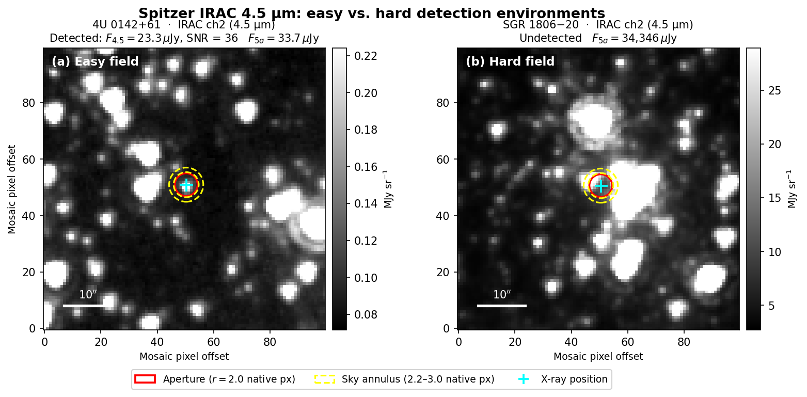
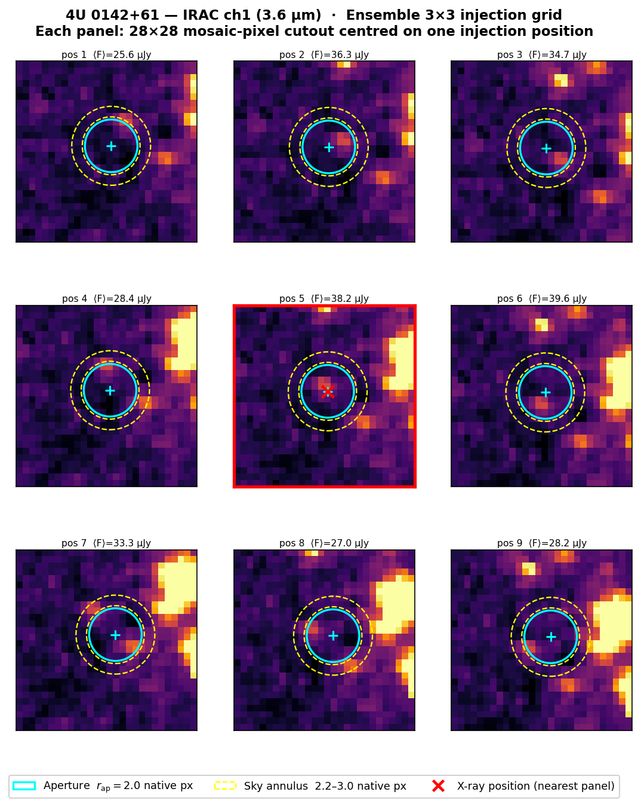
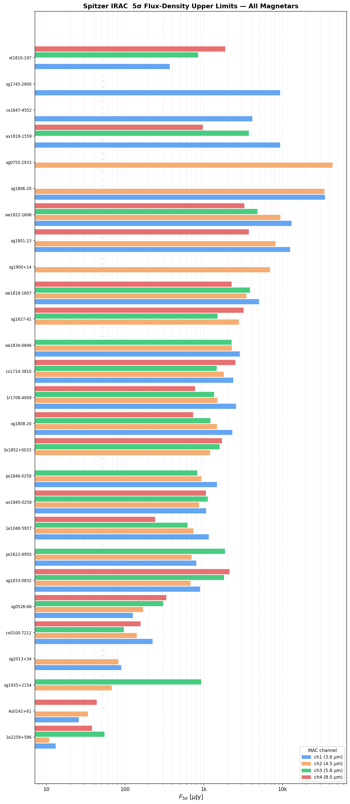
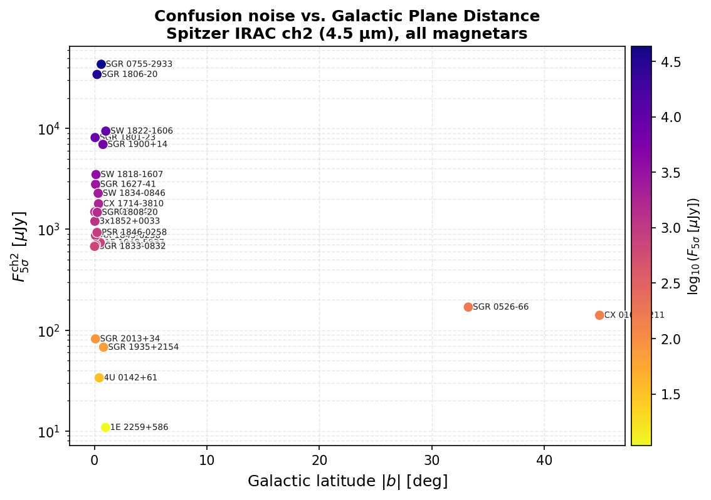

# IRACMagLim

**Ensemble PRF-injection photometry pipeline for Spitzer/IRAC magnetar 5σ flux limits.**

Developed as part of an MSc thesis at Nazarbayev University: *"Photometry of Magnetars in Spitzer Telescope Infrared Images"* (Darkhan Nurzhakyp, 2026).

*In honor of my supervisor, Dr. Bruce Grossan. Let his name live forever.*
---

## Scientific context

Magnetars are neutron stars with surface magnetic fields of 10¹⁴–10¹⁵ G whose mid-infrared emission distinguishes two competing physical models — a passive supernova fallback dust disk (predicting a rising IR SED, α > 0) versus non-thermal magnetospheric radiation (α < 0). Only two magnetars have confirmed Spitzer/IRAC detections. For the rest, the archival data constrain only upper limits.

Standard photometry tools (MOPEX/APEX) fail in crowded Galactic-plane fields because confusion noise — not photon statistics — limits sensitivity. The figure below illustrates why: a single aperture measurement is reliable in a clean field (left) but meaningless in a structured, confused background (right).



*Spitzer IRAC 4.5 µm cutouts. Left: 4U 0142+61 — detected at SNR = 36. Right: SGR 1806−20 — 5σ limit ~34,300 µJy, entirely due to confusion noise.*

IRACMagLim bypasses source detection entirely: it measures flux at the known X-ray position and characterises the local noise **empirically** by injecting synthetic PRFs at nearby positions in the real mosaic.

---

## How it works

For each target and IRAC channel the pipeline does three things:

**1. One-shot photometry** — forced circular aperture photometry at the known X-ray position (RA/Dec → mosaic pixel via `astropy.wcs`).

**2. Ensemble PRF injection** — the APEX PRF is trimmed, sub-pixel shifted, rebinned to mosaic scale, and injected at each of 9 positions in a 3×3 grid centred on the target. Aperture photometry runs on each simulated image; the scatter of recovered fluxes measures the true local noise.



*Each panel shows one injection position on the real 4U 0142+61 mosaic. Mean recovered flux is printed per panel. The red-bordered panel is closest to the catalogued X-ray position.*

**3. 5σ limit** — computed directly from the ensemble standard deviation:

```
σ_ens(F_inj) = std({ F_i^meas − F_inj }_{i=1}^{9})
F_5σ = 5 × mean_k(σ_ens(F_inj,k))
```

---

## Results

### 5σ sensitivity limits across 27 magnetars



*Limits span > 3 orders of magnitude — from ~10 µJy (1E 2259+586) to ~34,700 µJy (SGR 1806−20) — driven entirely by local background brightness, not exposure depth.*

### Sensitivity vs. Galactic latitude



*Sources closer to the Galactic plane (low |b|) suffer higher confusion noise and produce systematically weaker limits.*

### Physical interpretation

Multi-band spectral indices for the two detected sources are uniformly negative (α₂₄ = −0.49 ± 0.07 for 4U 0142+61), ruling out a passive fallback dust disk (α > 0) and consistent with the magnetospheric slope α = −0.96 measured by Hare et al. (2024) with JWST. Five targets with F₅σ(4.5 µm) < 200 µJy are the highest-priority candidates for JWST MIRI follow-up.

---

## Quick start

```bash
python -m venv .venv && source .venv/bin/activate   # Windows: .venv\Scripts\activate
pip install -e .[dev]
pytest                                               # verify installation
python main.py -i configs/default.yml               # run pipeline
python main.py -i configs/default.yml -v            # verbose / DEBUG logging
```

---

## Project layout

```
IRACMagLim/
├── main.py                   # CLI entry point
├── pyproject.toml
├── configs/
│   └── default.yml           # all pipeline parameters
├── mag_info/                 # target list (name RA Dec)
├── assets/                   # README figures (tracked)
├── src/
│   ├── config/loader.py      # YAML → AppConfig, validation
│   ├── core/
│   │   ├── photometry.py     # EnsemblePhotometry + perform_photometry()
│   │   ├── analysis.py       # process_all_magnetars() → 5σ limits
│   │   ├── idl_circapphot.py # circ_apphot (IDL-ported)
│   │   └── combine_results.py
│   └── utils/
│       ├── constants.py      # PSIZE_ASEC, APCOR, FACTORS, counts_to_ujy()
│       ├── io.py             # load_fits_image(), get_PSF(), save_rows()
│       ├── psf_utils.py      # make_PSF(), place_PSF()
│       └── plotting.py       # diagnostic plots
├── scripts/                  # standalone figure scripts (regenerate assets/)
└── results/
    └── photometry/           # per-target ensemble & one-shot CSVs
```

---

## Configuration

Pipeline driven by a flat YAML file. Required keys:

| Key | Description |
|-----|-------------|
| `magnetars_list_path_file` | Target list (`name ra dec`, whitespace-separated) |
| `data_path_folder` | Root of per-target mosaic directories |
| `prf_path` | Directory with APEX PRF FITS files |
| `channels` | IRAC channels to process, e.g. `[1, 2, 3, 4]` |
| `grid` | Grid size N for N×N injection positions |
| `spacing` | Mosaic-pixel spacing between grid positions |
| `rap_(cam_pix)` | Aperture radius in native IRAC pixels |
| `rbackin_(cam_pix)` | Inner annulus radius in native IRAC pixels |
| `rbackout_(cam_pix)` | Outer annulus radius in native IRAC pixels |

Key optional parameters:

| Key | Default | Description |
|-----|---------|-------------|
| `photometry_method` | `circ_apphot` | Backend: `circ_apphot` or `photutils` |
| `uJy_units` | `true` | Output in µJy; `false` → raw MJy/sr |
| `save_plots` | `false` | Aperture overlay diagnostic plots |
| `start_sim` | `true` | Run ensemble; `false` → one-shot only |
| `psf_trim_pixels` | `50` | Edge pixels to trim from raw APEX PRF |
| `output_formats` | `['csv']` | `csv`, `coldat`, or both |

Mosaic path convention: `<data_path_folder>/<name>/mosaici{ch}/Combine/mosaic.fits`  
PRF path convention: `<prf_path>/apex_sh_IRAC{ch}_col129_row129_x100.fits`

---

## Output files

| File | Columns |
|------|---------|
| `one_shot_data.csv` | `name, phot, sigma, channel, unit` |
| `ensemble_data.csv` | `name, ra, dec, channel, x_pos, y_pos, scale, expected_flux, flux, sigma, unit` |
| `all_sigma_ensemble.coldat` | `name, ch1_sens5(µJy), ch2_sens5(µJy), ch3_sens5(µJy), ch4_sens5(µJy)` |

---

## Recompute limits from existing ensemble data

```bash
python -c "
from src.core.analysis import process_all_magnetars
process_all_magnetars('results/photometry/ensemble_data.csv', 'results/output.coldat', grid=3)
"
```

---

## Troubleshooting

| Symptom | Fix |
|---------|-----|
| Missing PRF files | Check `prf_path` contains `apex_sh_IRAC{n}_col129_row129_x100.fits` |
| WCS conversion failure | Inspect FITS header — valid `CRVAL`, `CRPIX`, `CD` keywords required |
| `Invalid configuration` on startup | Loader validates all required keys and radius ordering; error identifies the failing key |
| `Expected N rows, got M` in analysis | Some grid positions failed — check logs for `make_PSF` or photometry warnings |
| Lower fluxes than literature | Likely annular over-subtraction in structured backgrounds; expected in Galactic-plane fields |

---
